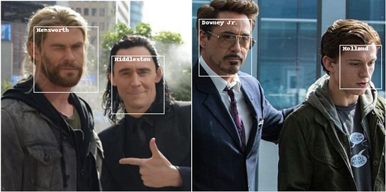
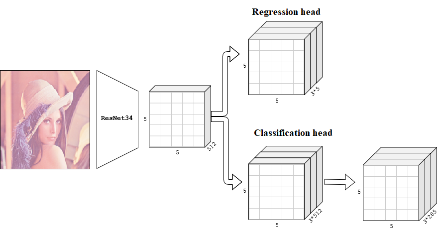

# Joint detection-identification with convolutional neural networks

This repo contains the code for my bachelor thesis on face detection and recognition.
It explores the ways of speeding up deep face recognition systems by switching from the traditional pipeline - detection -> alignment -> feature extraction -> classification - to oneshot regression-classification framework.



## Requrements

* `Python >= 3.6`
* `numpy`
* `PyTorch >= 1.0`
* `dlib`

## Get started
1. Download [FEI Face Database](https://fei.edu.br/~cet/facedatabase.html), [Caltech Faces 1999 dataset](www.vision.caltech.edu/Image_Datasets/faces/faces.tar), [Georgia Tech face database](http://www.anefian.com/research/face_reco.htm).
Organize your folders like this:

```
faces
├── fei
│   └── ...
├── caltech_faces
│   └── ...
└── gt_db
    └── ...
```

2. Run `preprocess.py`. After some time it will generate labels (bbox coordinates and class labels) for your data.

3. Run `organize_data.py`. It will downscale images (to 320px by default) and split them into trainset and testset.

Alterantively, download [already preprocessed dataset](https://drive.google.com/file/d/18fbb-puqi6hXyMtc0SgZ0MfBLOwlQ9zX/view?usp=sharing) that I used. It also contains images from google for 9 more subjects.

Run `train.py` to train the network.

## Network architecture


Network architecture is based on YOLO. DarkNet backbone is replaced with much more popular ResNet. Bbox attributes are separated from class probabilities and, furthermore, an additional layer for face embeddings is added. This will help to implement things like ArcFace or Triplet loss in the future.

## Training
The training process is much similar to YOLO training. Loss function is constructed similatly.


The difference is that I use `smooth L1 loss` for localization loss, `binary cross-entropy` for confidence loss and `cross-entropy` for classification loss.

## Results
This network was trained (on Google Colab) for 25 epochs with batch size = 128.

It was compared against traditional `dlib + ResNet34` pipeline.

|              | dlib + ResNet34 | Described net |
| ------------ | --------------- | -------- |
| **Accuracy** | 97.54%  | 98.15%  |
| **Mean IoU** | 79.82%  | 78.88%  |
| **FPS**      | 6.5  | 34.5  |

This numbers were obtained on laptop GTX 1050 GPU, so fps can vary. Also, I don't believe dlib uses GPU acceleration, so comparison against pipelines that use MTCNN will be less impressive.
